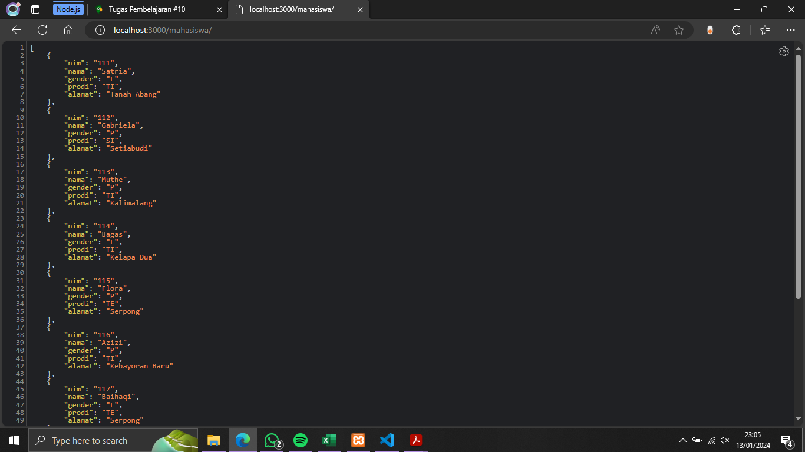

# Hasil Praktikum

## 1. running server.js ke '/mahasiswa'

## 2. '/mahasiswa/199' sebelum UPDATE
.png>)

## 3. '/mahasiswa/199' setelah UPDATE dengan METHOD PUT
.png>)

## 4. '/mahasiswa' setelah INSERT dan DELETE dengan METHOD POST dan DELETE
.png>)

## 5. detail '/mahasiswa/121' setelah INSERT dengan METHOD POST
.png>)

## 6. detail /mahasiswa/116' setelah DELETE dengan METHOD DELETE
.png>)

## 7. '/dosen'
.png>)

## 8. '/dosen' setelah UPDATE pada nip: , DELETE, dan INSERT
.png>)